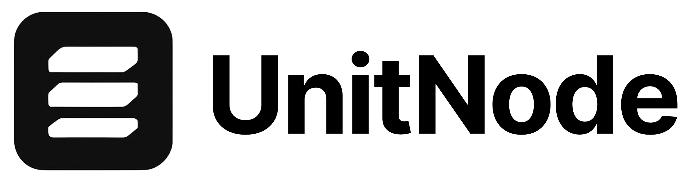

<div align="center">
  
</div>

# UnitNode - Property Management on Autopilot. 🏢

UnitNode is a property management software that aims to automate tasks for real estate property managers. By automating entire workflows (e.g. automatically: importing water bills, notifying tenants in their preferred langauge), UnitNode saves property managers several hours a day, making property management an efficient up-to-date process.

## 💡 Vision

UnitNode aims to transform property management by leveraging AIs, APIs, and a simplified system to make property management software actually save hours rather than extend and allow universal accessibility through multilingual software and communication. "Property Management on Autopilot."

## 🎯 Core Features (MVP)

- **Automated Utility Importation**: Forwards and parses utility emails extracting necessary information into PM database
- **Multilingual Communication**: Automatic tenant notifications in their preferred languages
- **Simplified Subscription System**: One-Subscription Platform needing no demos or company meetings to begin
- **Instant Mass Importation**: From Portfolio (export) -> Sheets -> UnitNode in seconds

## 🛠️ Tech Stack

UnitNode is built with:

### Frontend
- **Next.js 15** - React framework for production-grade applications
- **React 19** - UI component library
- **TypeScript** - Type-safe development
- **Tailwind CSS** - Utility-first CSS framework
- **Framer Motion** - Powerful animation library
- **Next Themes** - Dark/light mode theming

### Backend & Database
- **Prisma** - Type-safe ORM for database operations
- **Next.js API Routes** - Serverless API endpoints
- **NextAuth.js** - Authentication system
- **JWT** - Secure token-based authentication

### Security & Validation
- **Bcrypt** - Password hashing
- **Zod** - Schema validation and type inference
- **ESLint** - Code quality and consistency

### Development Tools
- **TypeScript** - Static typing for better development experience
- **Prisma Studio** - Database management interface
- **TurboRepo** - High-performance build system

## 🚀 Getting Started

```bash
# Clone the repository
git clone https://github.com/yourusername/unitnode.com.git

# Install dependencies
npm install

# Set up the database
npm run prisma:generate
npm run prisma:migrate

# Start the development server
npm run dev
```

## 🌐 Deployment

The platform is built with a focus on scalability and performance, utilizing Next.js's advanced features for optimal deployment and hosting capabilities.

---

*UnitNode - Launching MVP 1/30/25* (re-launch in TypeScript)

The easiest way to deploy your Next.js app is to use the [Vercel Platform](https://vercel.com/new?utm_medium=default-template&filter=next.js&utm_source=create-next-app&utm_campaign=create-next-app-readme) from the creators of Next.js.

Check out our [Next.js deployment documentation](https://nextjs.org/docs/app/building-your-application/deploying) for more details.
